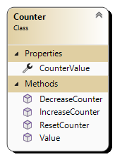

# KlasseTeller

Schrijf een klasse *Counter* waarmee je een teller kan simuleren.

Eigenschappen:

-   CounterValue: geeft en ontvangt een waarde.

Methods:

-   ResetCounter: zet de counter op 0.

-   IncreaseCounter: verhoogt counter met 1.

-   DecreaseCounter: vermindert counter met 1.

-   Value: verhoogt counter met opgegeven waarde.

